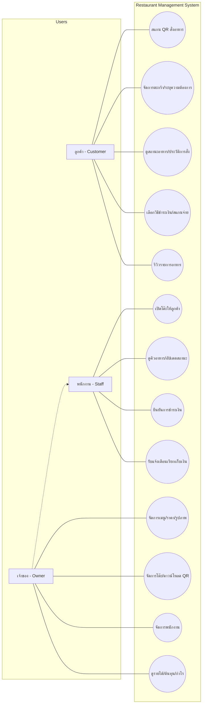

# -- 👨🏻‍🍳 tamsang 🍖 --
### ฑิฆัมพร ท้วมแก้ว 67102010161
### พิชชากร จลาสุภ 67102010167
### อามีน สาแม 67102010532
# # ที่มาของปัญหาและความสำคัญ
&nbsp;&nbsp;&nbsp;&nbsp;ในยุคปัจจุบันที่เทคโนโลยีเข้ามามีบทบาทสำคัญในการขับเคลื่อนเศรษฐกิจ ธุรกิจร้านอาหารเป็นหนึ่งในอุตสาหกรรมที่มีการแข่งขันสูงและต้องเผชิญกับความผันผวนของต้นทุนวัตถุดิบอย่างต่อเนื่อง อย่างไรก็ตาม ปัญหาที่พบเห็นได้บ่อยในกลุ่มผู้ประกอบการร้านอาหารขนาดกลางและขนาดย่อม คือการยังคงยึดติดกับระบบการจัดการแบบดั้งเดิม เช่น การใช้เมนูเล่มกระดาษ การจดบันทึกรายการอาหารและบัญชีรายรับ-รายจ่ายลงในสมุด ซึ่งวิธีการเหล่านี้ก่อให้เกิดข้อจำกัดต่างๆ
 
&nbsp;&nbsp;&nbsp;&nbsp;ข้อจำกัดแรกที่เคือ "ความล่าช้าและข้อจำกัดในการปรับตัวด้านราคา" เมนูอาหารในรูปแบบเดิมที่เป็นสิ่งพิมพ์ เมื่อราคาต้นทุนวัตถุดิบพุ่งสูงขึ้น เจ้าของร้านมักจะต้องตัดสินใจ ระหว่างการสั่งพิมพ์เมนูใหม่ทั้งหมดซึ่งมีค่าใช้จ่ายและใช้เวลา กับการแก้ไขปัญหาเฉพาะหน้าด้วยการใช้เทปปิดทับหรือการเขียนด้วยลายมือเพื่อเปลี่ยนราคา วิธีการนี้ส่งผลต่อภาพลักษณ์ของร้านอาหาร เนื่องจากเมนูที่มีรอยขีดฆ่าหรือคราบกาวจากการแปะทับทำให้ร้านดูไม่เป็นมืออาชีพ ลดทอนความน่าเชื่อถือ และอาจสร้างความสับสนระหว่างพนักงานกับลูกค้าในกรณีที่ข้อมูลไม่ชัดเจน ข้อจำกัดต่อมาคือ "ความไม่มีประสิทธิภาพในการจัดการคำสั่งซื้อ" การใช้กระดาษจดออเดอร์ มักนำไปสู่ปัญหาออเดอร์ตกหล่น สูญหาย หรืออ่านลายมือไม่ออก ซึ่งก่อให้เกิดความล่าช้าในการบริการและประสบการณ์ที่ไม่ดีแก่ลูกค้า นอกจากนี้ การใช้กระดาษสิ้นเปลืองในทุกขั้นตอนตั้งแต่การรับออเดอร์ไปจนถึงการเก็บสำเนาใบเสร็จ ยังถือเป็นต้นทุนแฝงที่ไม่จำเป็นและไม่เป็นมิตรต่อสิ่งแวดล้อม ข้อจำกัดสุดท้ายคือ "ความซับซ้อนและช่องว่างของการบันทึกบัญชี" การจดบันทึกรายจ่ายที่เป็นต้นทุนและรายรับจากการเช็คบิลลงในสมุดด้วยมือนั้น มีความเสี่ยงสูงต่อการเกิดความคลาดเคลื่อน ข้อมูลที่กระจัดกระจายทำให้เจ้าของร้านไม่สามารถประเมินกำไรสุทธิที่แท้จริงได้ อีกทั้งยังขาดระบบที่ช่วยคำนวณสรุปภาพรวมในระยะยาว ทำให้ยากต่อการวิเคราะห์แนวโน้มยอดขายหรือการวางแผนสต็อกวัตถุดิบ
 
&nbsp;&nbsp;&nbsp;&nbsp;จากสภาพปัญหาดังกล่าว จึงนำมาสู่แนวคิดในการพัฒนาเว็บแอปพลิเคชันบริหารจัดการร้านอาหารยุคใหม่ เพื่อเป็นเครื่องมือในการเปลี่ยนผ่านการทำงานสู่ระบบดิจิทัล โดยแอปพลิเคชันนี้ไม่ได้ทำหน้าที่เพียงแค่ใช้ในการสั่งอาหารเท่านั้น แต่ยังทำหน้าที่เป็น ระบบช่วยให้เจ้าของร้านสามารถปรับเปลี่ยนรายการอาหารและราคาได้ทันทีผ่านระบบออนไลน์ รองรับการบันทึกต้นทุนและรายรับอย่างเป็นระบบ ซึ่งจะถูกนำไปประมวลผลเพื่อสรุปภาพรวมของธุรกิจ
# # จุดประสงค์ และ ประโยชน์ที่คาดว่าจะได้รับ
1. เพื่อช่วยให้เจ้าของกิจการสามารถเพิ่มลดเมนูและ สามารถปรับเพิ่มลดราคาในเมนูได้สะดวก 
2. เพื่อช่วยให้เจ้าของกิจการเห็นภาพรวมรายรับรายจ่ายและ ยอดขายของร้านค้า 
3. เพิ่อช่วยให้ลูกค้าสะดวกในการเข้ามาใช้บริการ 
# # ขอบเขต
- เป็นเว็บไซต์ในการใช้สั่งอาหารและ จัดการระบบหลังร้าน
- ระบบสามารถเปลี่ยนแปลงรายการอาหารและ เพิ่มลดราคาอาหารได้
- ระบบสามารถแสดงรายรับ(มาจาการกดชำระเงิน) รายจ่าย(ต้นทุนที่เจ้าของกิจการกรอก) ยอดขายและ สามารถคำนวณกำไรขาดทุนได้
- ระบบสามารถแสกนคิวอาร์โค้ดเพื่อดูเมนู สั่งอาหารได้ และชำระเงินได้
- ระบบสามารถแสดงรายการอาหารยอดนิยมได้
- ระบบสามารถแสดงสถานะของอาหารที่สั่งได้
# # Functional requirement
1. ระบบสามารถแจ้งเตือนเมื่อลูกค้าเรียกชำระเงินได้
2. ระบบสามารถคำนวณกำไรจากต้นทุน และรายรับได้
3. ระบบสามารถคำนวณราคาอาหารที่ลูกค้าสั่งได้
4. ระบบสามารถแสดงใบเสร็จออนไลน์ และดาวน์โหลดได้
5. ระบบสามารถบันทึกประวัติการสั่งอาหารได้
6. ระบบสามารถแสดงคิวอาร์โค้ดที่ระบุยอดเงินแล้วให้ลูกค้าแสกนจ่าย เมื่อลูกค้าเลือกช่องทางการสแกนจ่าย
7. เจ้าของกิจการสามนารถจัดหมวดหมู่ประเภทของอาหารได้
8. เจ้าของกิจการสามารถเพิ่มลดรายการอาหารได้
9. เจ้าของกิจการสามารถเพิ่มรูปภาพอาหารได้
10. เจ้าของกิจการสามารถเพิ่มและแก้ไขส่วนประกอบของอาหารได้
11. เจ้าของกิจการสามารถปรับเพิ่มลดราคาอาหารได้
12. เจ้าของกิจการสามารถเพิ่มลดจำนวนโต๊ะได้
13. เจ้าของกิจการสามารถเปลี่ยนชื่อโต๊ะได้
14. เจ้าของกิจการสามารถดาวน์โหลดคิวอาร์โค้ดของแต่ละโต๊ะได้
15. เจ้าของกิจการสามารถบันทึกต้นทุนที่ใช้ในแต่ละวันได้
16. เจ้าของกิจการสามารถเพิ่มลบพนักงานได้
17. เจ้าของกิจการสามารถดูข้อมูลรายได้และ ยอดขายย้อนหลังได้
18. พนักงานสามารถเปลี่ยนแปลงสถานะอาหารว่าพร้อมขายหรือไม่
19. พนักงานสามารถกดยืนยันการชำระเงินได้
20. พนักงานสามารถเลือกโต๊ะที่จะเปิดให้ลูกค้าสั่งอาหารได้
21. พนักงานสามาถดูรายการอาหารที่ลูกค้าสั่งมาตามคิวได้
22. พนักงานสามารถแก้ไขและยกเลิกรายการอาหารที่ลูกค้าสั่งได้
23. พนักงานสามารถอัปเดตสถานะของรายการอาหารลูกค้าได้
24. ลูกค้าสามารถแสกนคิวอาร์โค้ดเพื่อดูเมนูและ สั่งอาหารได้
25. ลูกค้าสามารถทำการค้นหารายการอาหารได้ 
26. ลูกค้าสามารถเพิ่มหรือ ลบรายการอาหารในตะกร้าได้
27. ลูกค้าสามารถระบุความต้องการเพิ่มเติมได้่
28. ลูกค้าสามารถตรวจสอบส่วนประกอบของอาหารได้
29. ลูกค้าสามารถตรวจสอบรายการอาหารที่สั่งไปแล้วได้
30. ลูกค้าสามารถตรวจสอบสถานะของรายการอาหารที่สั่งไปได้
31. ลูกค้าสามารถเลือกวิธีการชำระเงิน
32. ลูกค้าสามารถชำระเงินผ่านคิวอาร์โค้ดได้
33. ลูกค้าสามารถแสดงความคิดเห็นรายการอาหารที่สั่งได้้
# # Non-Functional requirement
1. ผู้ใช้ต้องการเว็บสวยๆ ใช้งานง่าย
2. ผู้ใช้ต้องการเว็บที่ใช้งานได้ทุกระบบ
3. ผู้ใช้ต้องการรูปภาพอาหารหลายๆมุม 
4. ผู้ใช้ต้องการเว็บที่ตัวอักษรอ่านออกง่ายๆ
5. ระบบรองรับผู้ใช้หลายคน
6. ระบบคำนวณตัวเลขได้แม่นยำ
# # Use case diagram

# # อธิบายกระบวนการทำงาน โดยใช้ process, methods, and tools อย่างไร
Process
- เก็บ Requirements 
- วิเคราะห์ Requirements 
- ทำเอกสารประกอบโครงงาน
- บันทึกวิดีโอ Retrospective

Method
- เก็บ Requirements โดยนั่งถามตอบ
- นำ Requirements ที่ได้มาทำการเขียน Requirements ที่คิดว่าจำเป็นเพิ่มจากที่ลูกค้าให้มา
- เขียนที่มา ปัญหา วัตถุประสงค์ และขอบเขตของโครงงาน
- บันทึกวิดีโอ Retrospective โดยใช้ วิดีโอคอลzoom

Tools
- เก็บ Requirements โดยนั่งถามตอบ พร้อมกับบันทึกวิดีโอระหว่างการถามตอบ
- นำ Requirements ที่ได้มาทำการเขียน Requirements ที่คิดว่าจำเป็นเพิ่มจากที่ลูกค้าให้มา บน Visual Studio Code แบบ Live Share และนำไปใส่ใน Github
- เขียนที่มา ปัญหา วัตถุประสงค์ และขอบเขตของโครงงาน บน Visual Studio Code แบบ Live Share และนำไปใส่ใน Github
- บันทึกวิดีโอ Retrospective โดยใช้ วิดีโอคอลzoom และอัปโหลดวิดีโอบน Youtube
# # Requirement Video
เริ่มการนำเสนอเว็บที่จะทำว่ามีฟังก์ชันพื้นฐานการทำงานยังไง และเริ่มสอบถามความต้องการลูกค้าในแต่ละส่วน โดยแบ่งเป็น ส่วนของลูกค้าและเจ้าของกิจการ จนครบตามความต้องการ และนำมาเขียนเป็น Functional and Non-Functional Requirement 
https://youtu.be/Tu0NJspD0Ew
# # Retrospective
สรุปการประชุมได้ว่า ที่ผ่านมาใน sprint1 ทุกคนช่วยทำงานกันได้เรียบร้อย และตรงต่อเวลา ส่วนในสิ่งที่ต้องปรับปรุงกัน คือ มีการวางแผนกันยังไม่ละเอียดพอ ทำให้ลืมเก็บ requirement ในบางส่วน จึงทำให้ใน sprint ถัดไปๆต้องวางแผนก่อนการเริ่มทำงานให้ดีขึ้นกว่านี้ เพื่อไม่ให้พลาดเล็กๆน้อยในงานได้อีก 
https://youtu.be/FtyqKcocLs8
