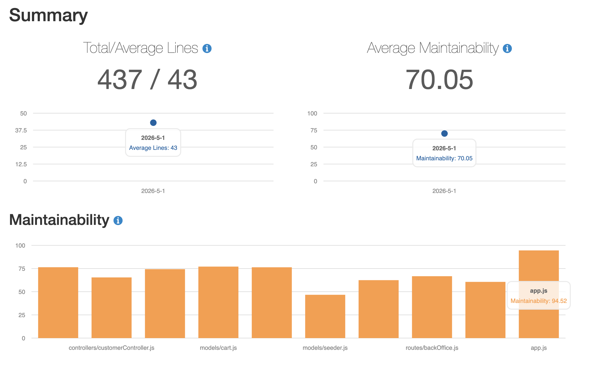
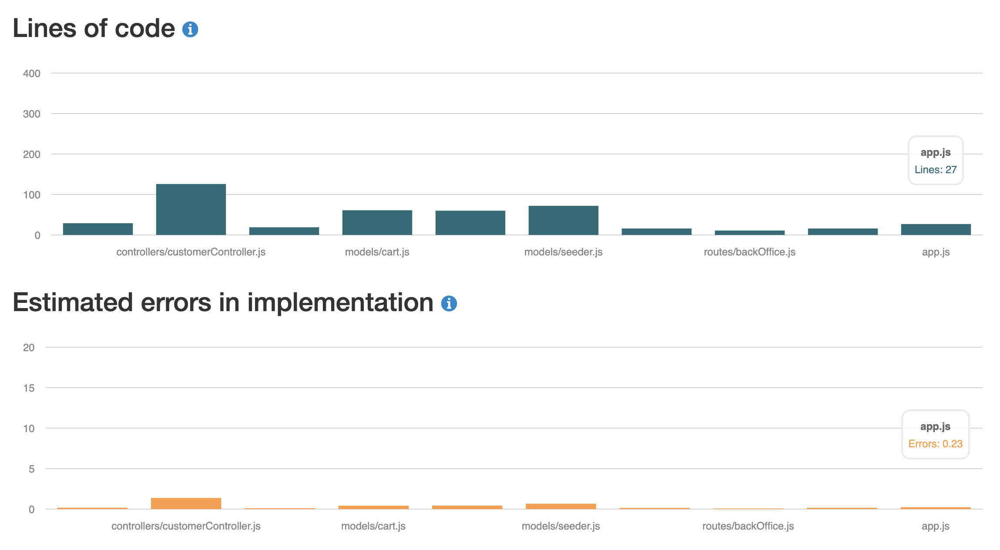
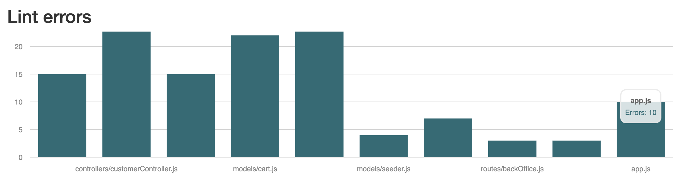
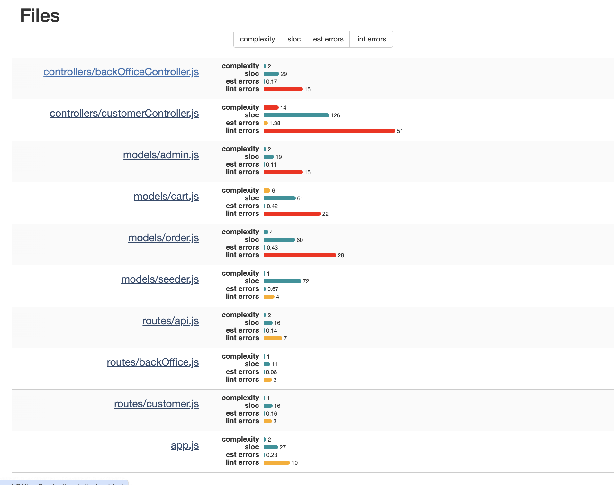

## เปรียบเที่ยบ static profiling sprint3 vs sprint 4

## sprint 3

## sprint 4

### จากรูปผลทั้งสอง sprint ไม่ได้มี ความซับซ้อนหรืออะไรต่างๆ ผลต่างกันมากเนื่องจาก sprint 4 ไม่ได้เข้าไปปรับโค้ดหลักๆ อะไรเลย มีแค่การเพิ่มฟังก์ชัน login ด้วย google จึงมีจำนวนบรรทัดเยอะขึ้น ก็จะมีความซับซ้อนและโอกาสการเกิด error เพิ่มขึ้น