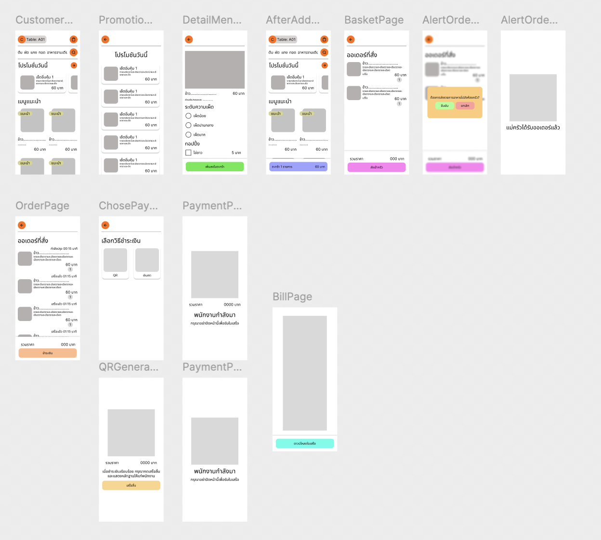
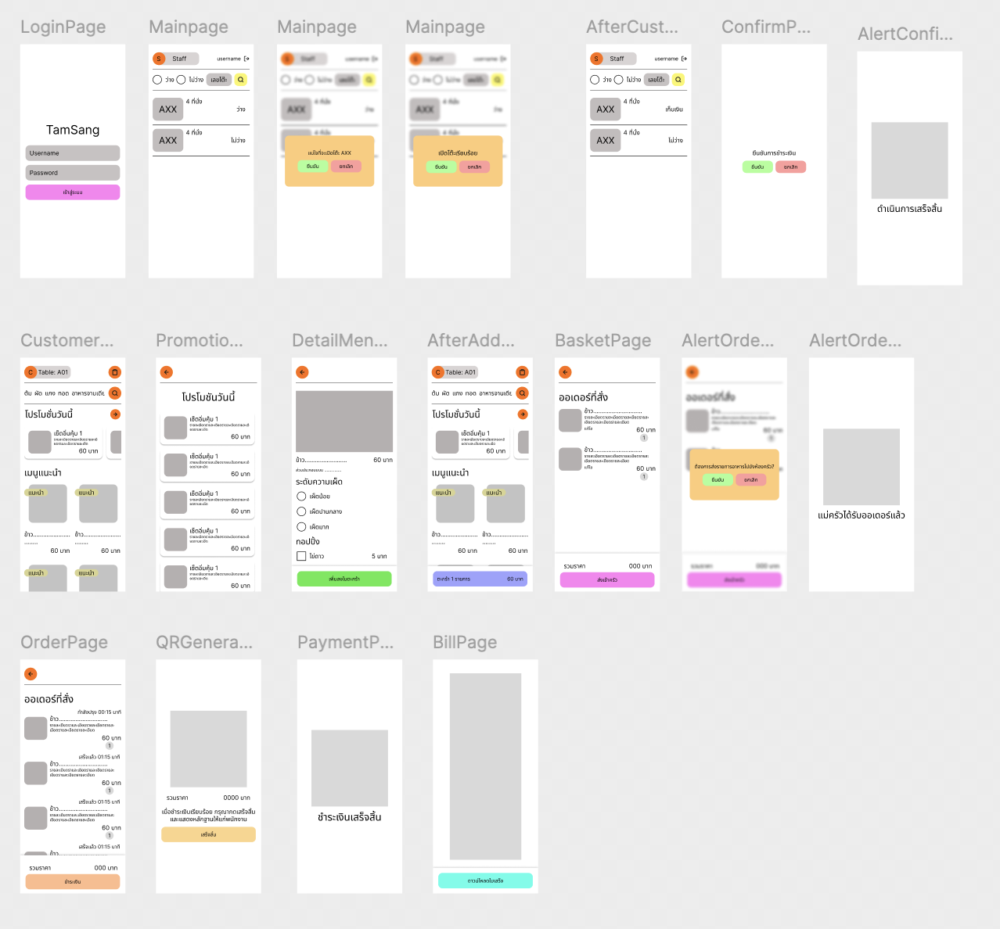
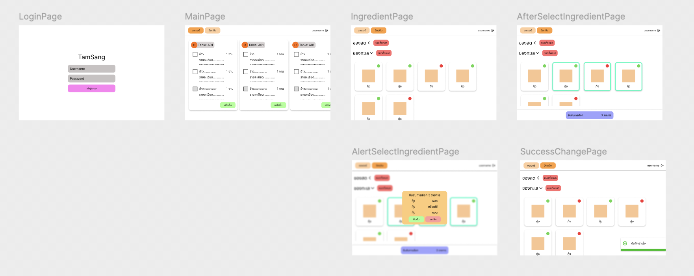
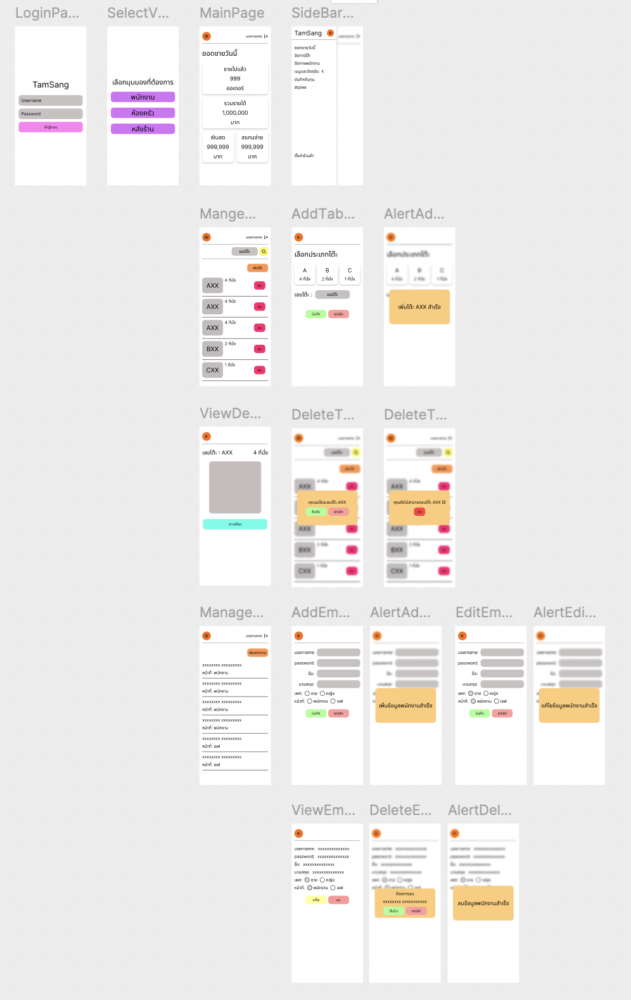
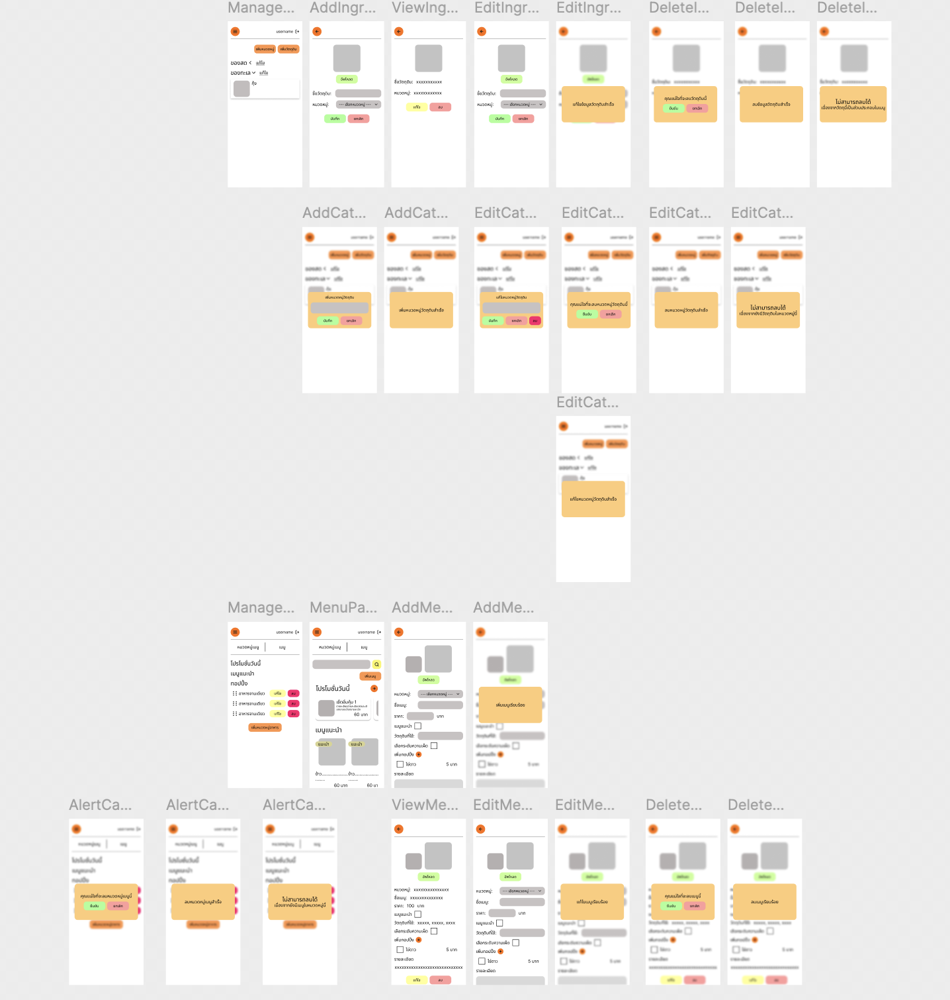
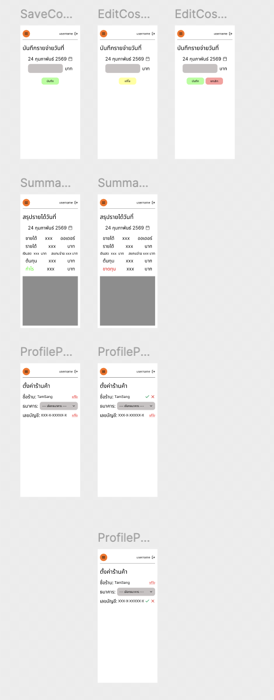

## figma 
https://www.figma.com/design/HTp2M9ELj1nJCKScD4idpX/tamsang?node-id=0-1&t=8VprC7JkNDXrHWnv-1

## playlist scrum & retrospective (summary in description video)
https://www.youtube.com/playlist?list=PLd8o10RYJyL4BCrSEQgmPiW0E1RrhWAKX

# User Interface
## Customer

<!--  -->

## Staff

<!--  -->

## Chef

<!--  -->

## Owner

<!-- 

 -->

