## playlist scrum & retrospective (summary in description video)
https://www.youtube.com/playlist?list=PLd8o10RYJyL5e3ah95SEIZTuef9XT_0WY

## สรุปการทำงานของโปรแกรม
### get method
#### - customer
router.get('/', customerController.getAll); => ดึงข้อมูลเมนูและประเภทเมนูทั้งหมด มาแสดงหน้าเมนูของลูกค้า

router.get('/promotions', customerController.getPromotionMenu); => ดึงข้อมูลเมนูและประเภทเมนูโปรโมชั่น มาแสดงหน้าเมนูโปรโมชั่นของลูกค้า

router.get('/menu/:id', customerController.getDetail); => ดึงข้อมูลเมนูรายละเอียดเมนูต่างๆ เช่น ชื่ิอ ราคา เป็นต้น มาเแสดงให้หน้าเพิ่มลงตะกร้า

router.get('/cart', customerController.getCartPage); => ดึงข้อมูลรายการที่มีในตะกร้ามาแสดง ในตะกร้า

router.get('/order', customerController.getOrder); => ดึงข้อมูลรายการที่สั่งมาแสดง ในออเดอร์
#### - backOffice
router.get('/', backOfficeController.getLoginPage); => แสดงหน้า login

router.get('/orderHistory',backOfficeController.getOrderHistory); => แสดงประวัติออเดอร์

router.get('/logOut',backOfficeController.logout); => logout และกลับหน้า login
### post method
#### - customer
router.post('/cart/add', customerController.addToCart); => ส่งเมนูที่กดเพิ่มใส่ตะกร้าเข้าตะกร้า

router.post('/cart/remove', customerController.removeToCart); => ลบรายการในตะกร้า

router.post('/order/add', customerController.confirmOrder); => ยืนยันการส่งเข้าครัว เพื่อย้ายข้อมูลไปอยู่ในออเดอร์ 

router.post('/order/checkout', customerController.checkout); => กดชำระเงิน และเก็บข้อมูลไว้เป็น history
#### - backOffice
router.post('/', backOfficeController.login); => ส่งข้อมูลการ login เช็ค username/password
### Unit Test cases ที่ทดสอบ data structure
| Data Structure | คำอธิบายการทดสอบ | ผลลัพธ์ที่คาดหวัง |
| :--- | :--- | :--- |
| **Cart (Array)** | เพิ่มสินค้าใหม่ลงในตะกร้าว่าง | `Cart.getCart().length` เพิ่มเป็น 1 |
| **Cart (Array)** | เพิ่มสินค้าเดิมซ้ำ (Duplicate Menu ID) | จำนวนชิ้น (`quantity`) เพิ่มขึ้น แต่รายการไม่ซ้ำซ้อน |
| **Cart (Array)** | ลบสินค้าออกจากตะกร้าแบบระบุ ID | รายการสินค้า ID นั้นหายไปจาก Array ทั้งหมด |
| **Menu (Object)** | เลือกเมนูด้วย ID ที่ถูกต้อง (`selectById`) | ได้ Object เมนูที่มีข้อมูลครบถ้วน |
| **Menu (Object)** | เลือกเมนูด้วย ID ที่ไม่มีอยู่จริง | คืนค่าเป็น `null` |
| **Category (Array)** | สร้างหมวดหมู่ใหม่ที่มีชื่อซ้ำกับของเดิม | ไม่เพิ่มข้อมูลลงใน Array เพื่อป้องกันชื่อซ้ำ |
| **Order (Object)** | ย้ายข้อมูลจาก `Cart` ไปยัง `Order` | ข้อมูลใน `Order` ครบถ้วน และ `Cart` กลายเป็นว่างเปล่า |
| **Order History** | ตรวจสอบการบันทึกประวัติหลัง Checkout | จำนวนรายการใน `History` เพิ่มขึ้นตามจริง |
| **Order ID** | ตรวจสอบการรันเลข Order ID เมื่อสั่งต่อเนื่อง | ID ของออเดอร์ถัดไปต้องไม่ซ้ำกับออเดอร์เดิม |
| **Bill (Object)** | ตรวจสอบโครงสร้าง Object หลังชำระเงิน | ได้ Object ที่มีสถานะเป็น `"Paid"` และยอดเงินถูกต้อง |

### Unit Test cases ที่ทดสอบ class
| Class/Module | Method ที่ทดสอบ | คำอธิบายการทดสอบ | ผลลัพธ์ที่คาดหวัง |
| :--- | :--- | :--- | :--- |
| **Admin** | `login()` | ตรวจสอบ Username และ Password ที่ถูกต้อง | คืนค่า `true` (bcrypt) |
| **Admin** | `login()` | กรณีใส่รหัสผ่านผิด หรือชื่อผู้ใช้ผิด | คืนค่า `false` |
| **Cart** | `calculateTotal()` | คำนวณราคาสุทธิสินค้าทุกรายการในตะกร้า | ยอดรวม (Price × Qty) ถูกต้อง |
| **Cart** | `getCartItemCount()` | นับจำนวน "รายการ" สินค้าในตะกร้า | คืนค่าตัวเลขจำนวนรายการที่ถูกต้อง |
| **Order** | `confirmCartToOrder()` | เรียกใช้ฟังก์ชันในขณะที่ตะกร้าว่างเปล่า | ไม่สร้างออเดอร์ใหม่ |
| **Order** | `checkout()` | ชำระเงินในขณะที่ไม่มีออเดอร์ค้างอยู่ | คืนค่า `null` |
| **CategoryMenu** | `deleteById()` | ลบหมวดหมู่ที่ถูกตั้งค่า `canEdit = false` | คืนค่า `null` (ห้ามลบ) |
| **CategoryMenu** | `deleteById()` | ลบหมวดหมู่ที่มีเมนูอาหารผูกอยู่ | คืนค่า `null` (ป้องกัน Data Error) |
| **CategoryMenu** | `updateById()` | เปลี่ยนชื่อหมวดหมู่เป็นชื่ออื่นที่ว่างอยู่ | คืนค่า Object ที่อัปเดตชื่อใหม่แล้ว |
| **Menu** | `updateById()` | อัปเดตเฉพาะ "ราคา" ของอาหาร | ข้อมูลอื่นๆ (ชื่อ/หมวดหมู่) ยังคงเดิม |
| **Menu** | `create()` | สร้างเมนูโดยระบุหมวดหมู่ที่ไม่มีอยู่จริง | คืนค่า `null` (FK Constraint) |

## สิ่งที่ยังไม่เสร็จสมบูรณ์
1. ระบบ login ยังไม่ได้มีการสร้าง session และ auth ที่ปลอดภัย
2. ui บางส่วนยังไม่เรียบร้อย

## Website screenshot
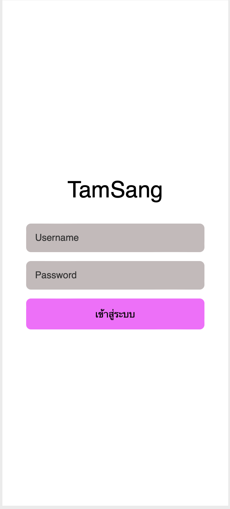

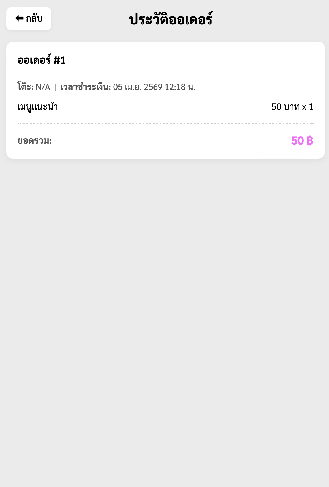

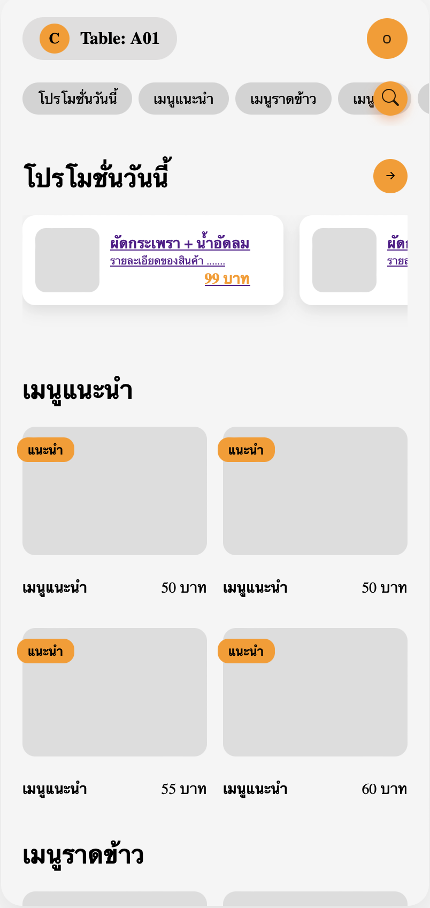
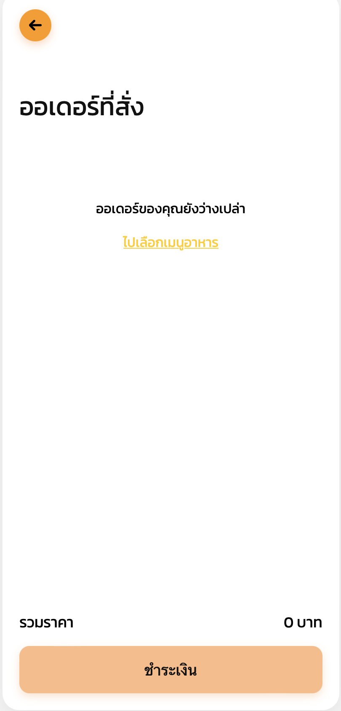
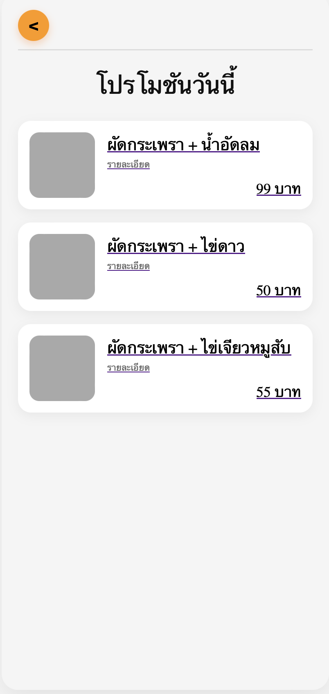
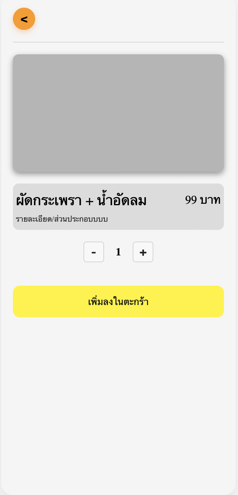
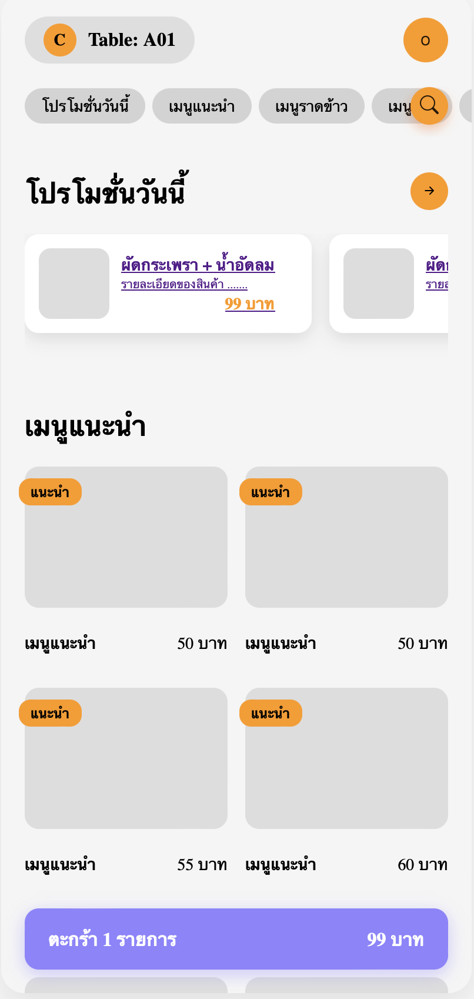
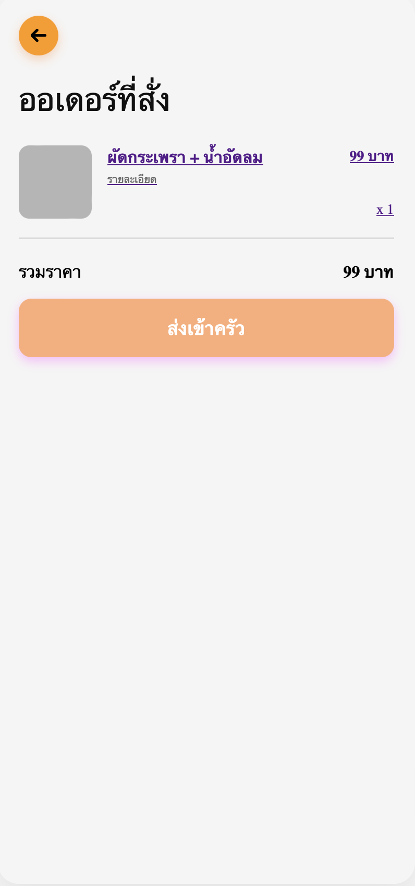
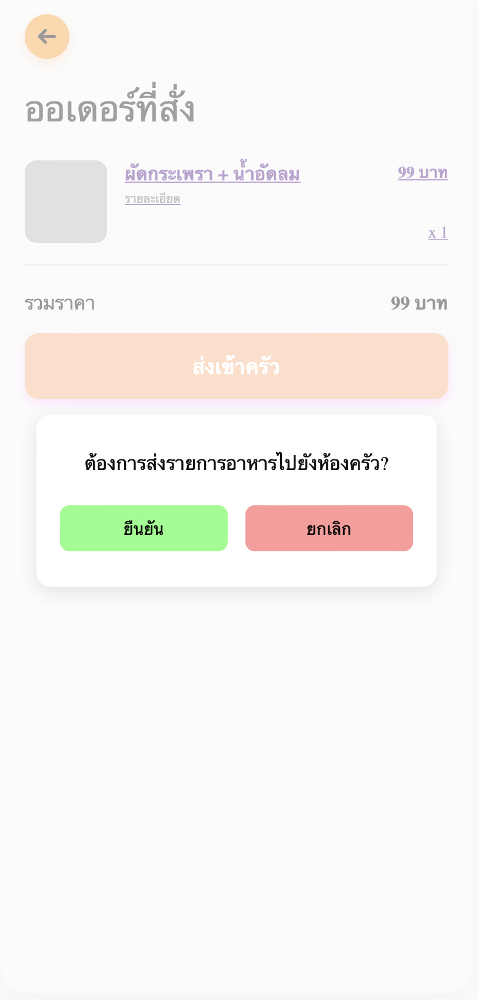
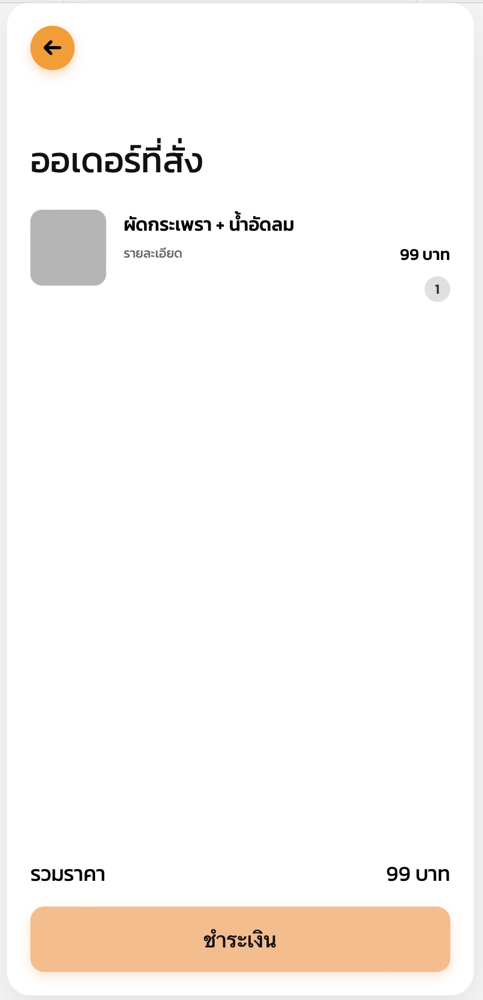
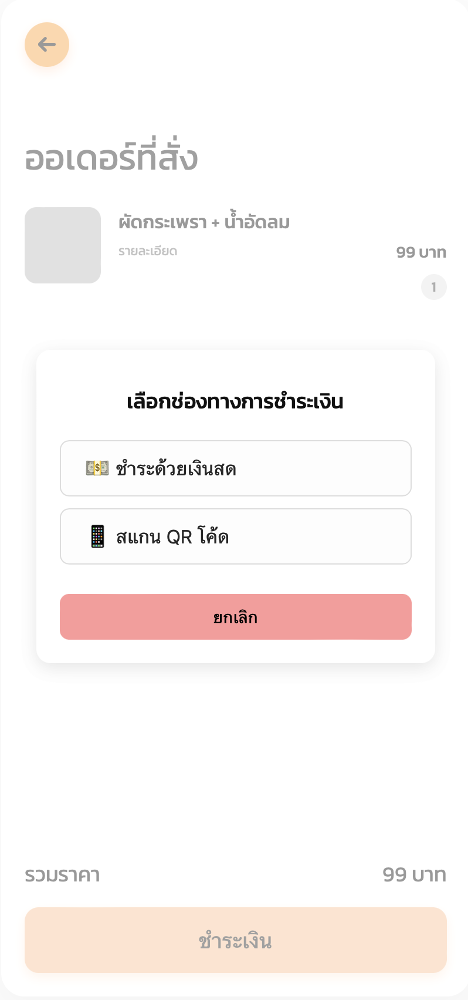