## Website screenshot
### ================================= Customer =================================
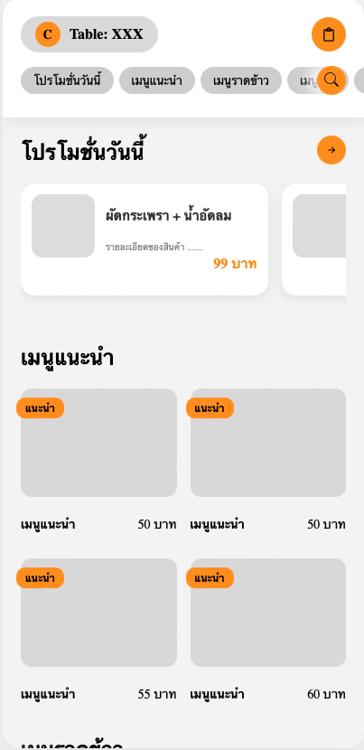
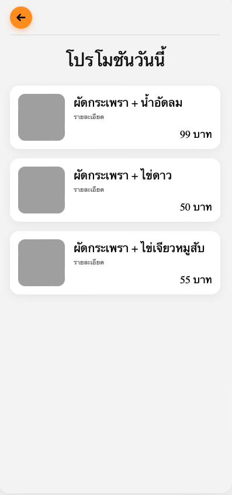
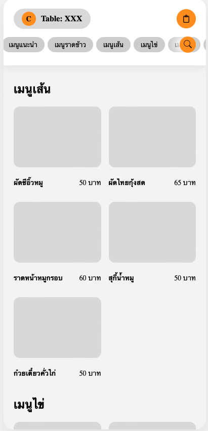
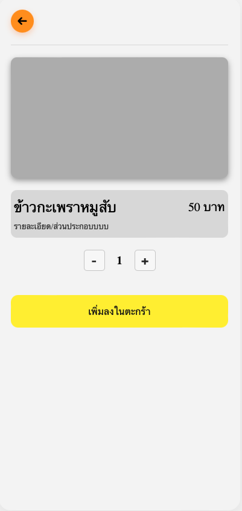
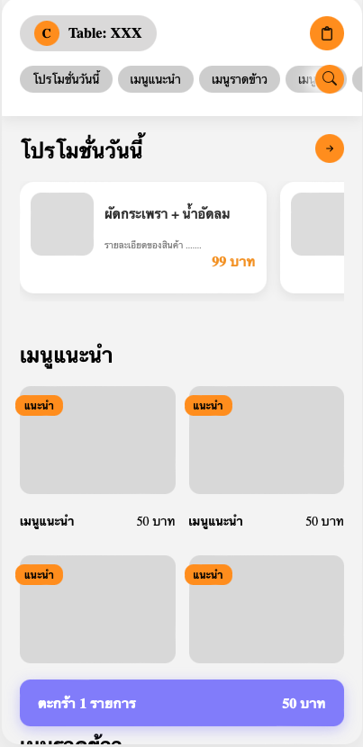
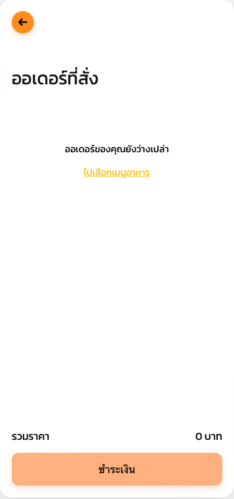
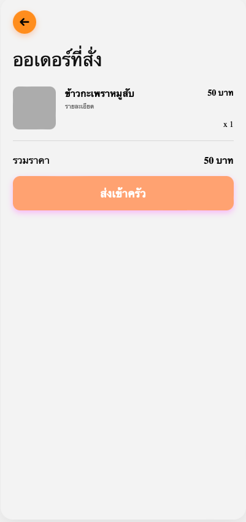
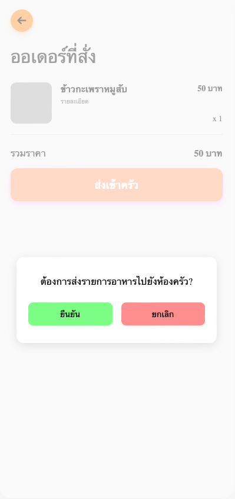
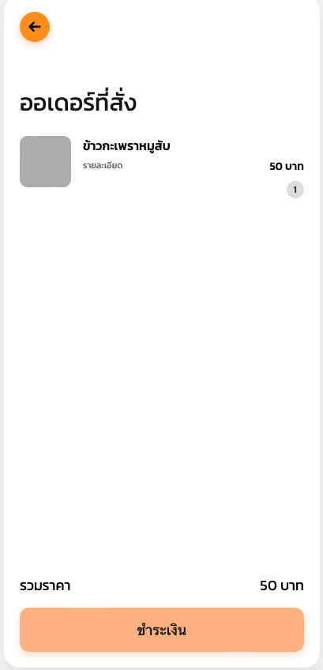
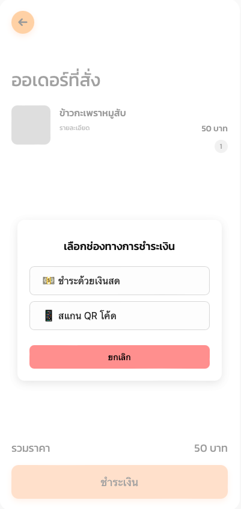

### ================================= BlackOffice =================================
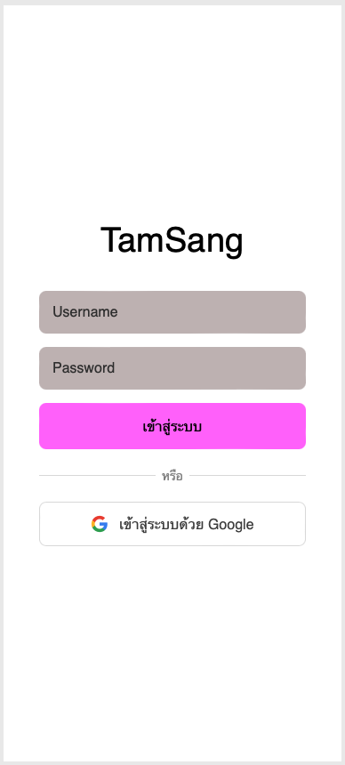
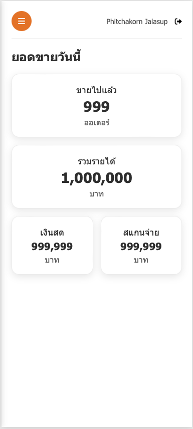
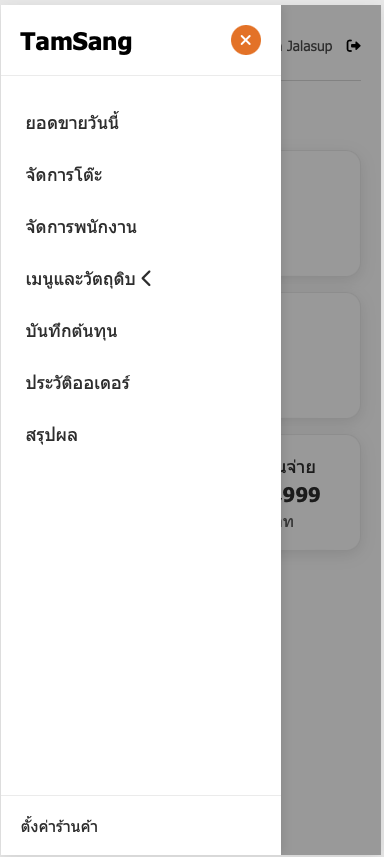
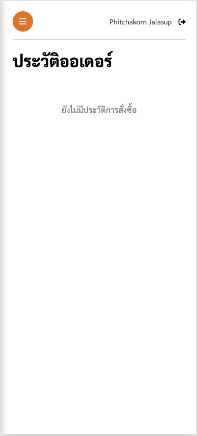
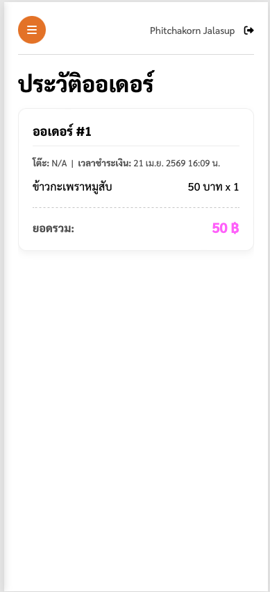

## UI testcases
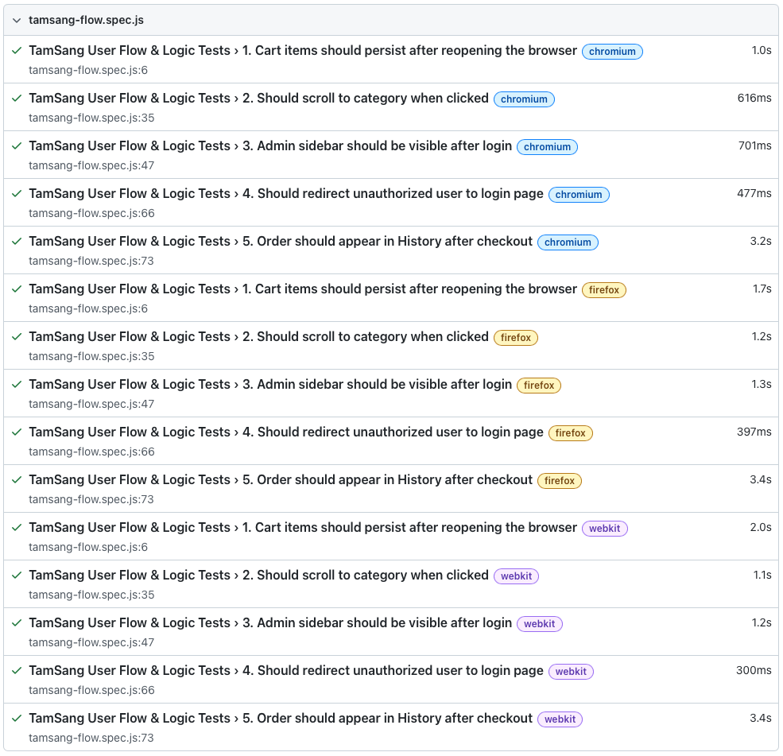

## profiling
### ================================= Static profiling =================================
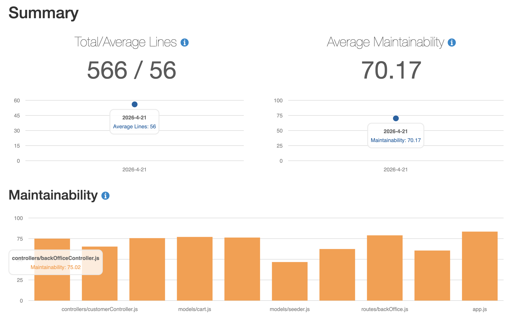
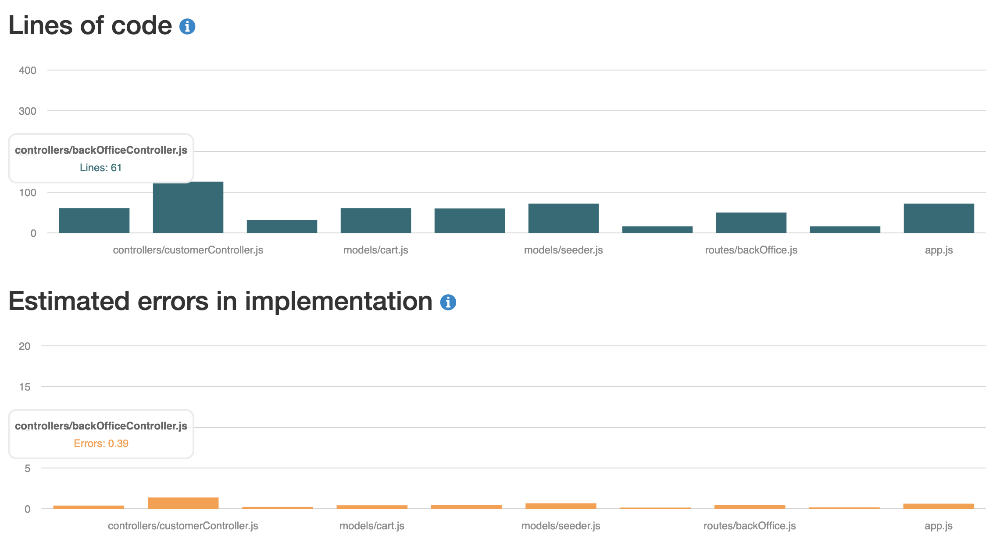
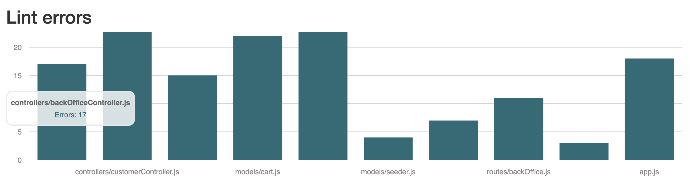
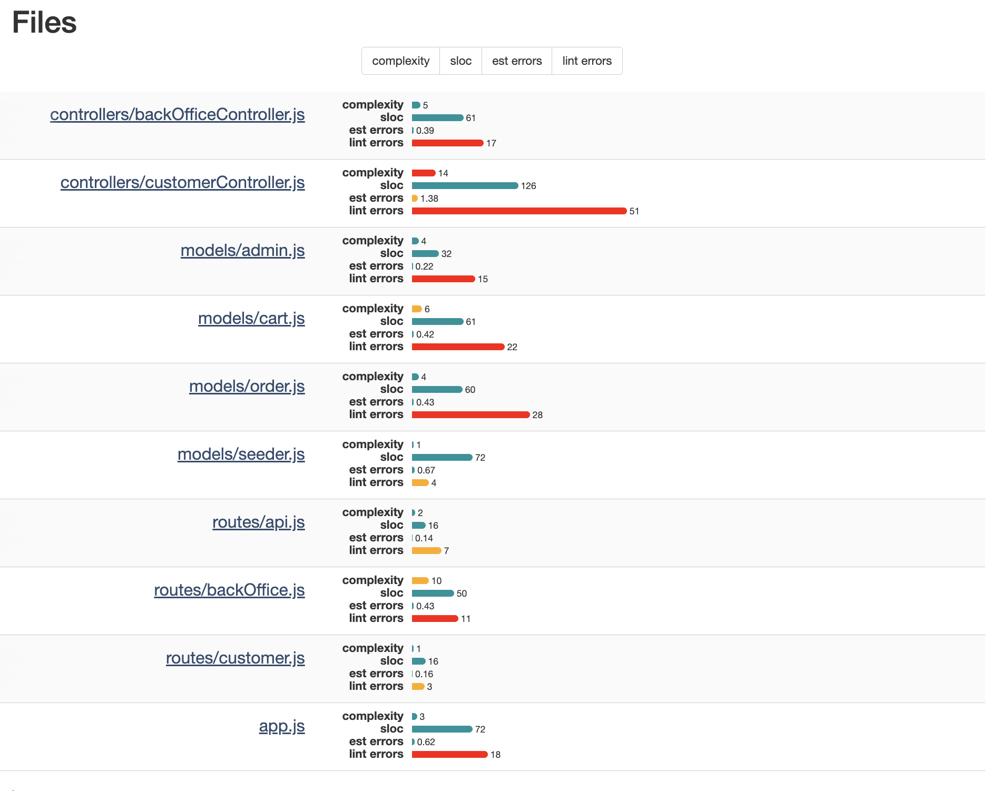

### ================================= Dynamic profiling =================================
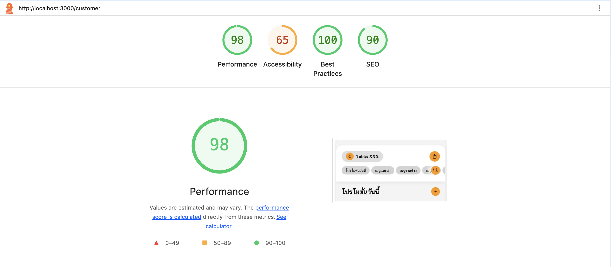

## อธิบายการทำ CI/CD ที่ใช้ในการทำ product
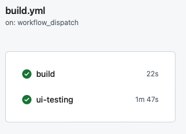

### 1. Job: build (Unit Testing)
ตรวจสอบ "ตรรกะภายใน" ของโค้ด (Logic/Models) ว่าคำนวณถูกไหม เชื่อมต่อ Database จำลองได้หรือไม่ 
เป้าหมาย: รันไฟล์ในโฟลเดอร์ test/ (พวก *.test.js) 
กระบวนการ: ติดตั้ง Library แล้วใช้ Jest รันสคริปต์ทดสอบโดยตรง ไม่ต้องเปิดหน้าเว็บ ไม่ต้องรัน Server จริง 

### 2. Job: ui-testing (End-to-End Testing)
ตรวจสอบ "ประสบการณ์ผู้ใช้" (User Flow) โดยจำลองการใช้งานจริงผ่าน Browser 
เป้าหมาย: รันไฟล์ในโฟลเดอร์ tests/ (พวก *.spec.js) 
กระบวนการ: 
1.  ติดตั้ง Browser (Chromium/Firefox)
2.  สั่ง npm start & เพื่อเปิด Server ของแอปขึ้นมาจริงๆ ในเครื่องจำลอง
3.  ใช้ wait-on รอจนหน้าเว็บ localhost:3000 ตื่นขึ้นมาพร้อมใช้งาน
4.  ใช้ Playwright เปิด Browser เข้าไปกดปุ่ม, กรอกฟอร์ม และเช็คผลลัพธ์บนหน้าจอ

## กระบวนการทำงาน
- process:
  - การออกแบบ UX/UI

  - การพัฒนาโค้ด

  - การทดสอบระบบแบบอัตโนมัติ (Automated Testing): เพิ่มขั้นตอนการตรวจสอบโค้ดทุกครั้งก่อนส่งงาน เพื่อป้องกันข้อผิดพลาด (Bugs) ในระดับ Logic และ UI

  - การวิเคราะห์คุณภาพซอฟต์แวร์ (Static Code Analysis): เพิ่มการตรวจสอบโครงสร้างโค้ดและความซับซ้อน เพื่อให้โค้ดอ่านง่ายและบำรุงรักษาได้ในระยะยาว

  - การทำ Continuous Integration (CI): สร้างระบบที่ช่วยรันเทสและตรวจสอบความพร้อมของโปรเจกต์โดยอัตโนมัติบน Cloud
 
  - การทำ Continuous Delivery (CD): ช่วยในการ deploy product
- methods:
  - สร้าง Prototype เพื่อกำหนด Flow การใช้งานและ Mood & Tone ของแอปพลิเคชัน

  -  Unit Testing: ใช้การเขียนสคริปต์ทดสอบฟังก์ชันแยกเป็นส่วนๆ (เช่น ระบบ Login, การคำนวณราคาสั่งอาหาร) เพื่อเช็คความถูกต้องของ Logic

  - End-to-End (E2E) UI Testing: จำลองพฤติกรรมผู้ใช้จริง (User Flow) ตั้งแต่การเข้าหน้าเว็บ เลือกเมนู จนถึงการชำระเงิน

  - Parallel Execution: แยกการทำงานของ Test ออกเป็นหลายส่วน (Jobs) และรันพร้อมกันเพื่อลดเวลาในการรอผล

  - Environment Mocking: การจำลองค่าตัวแปรสภาพแวดล้อม (Env) และการ Bypass ระบบบางส่วนที่ไม่ได้ทดสอบ (เช่น Google OAuth) เพื่อให้เทสเดินหน้าต่อได้
- tools:
  - Figma (ใช้ในการทำ Design System, Wireframing และ Prototyping)

  - Node.js: ใช้เป็น Runtime หลักในการเขียนโปรแกรม บน Visual Studio Code

  - GitHub Actions: ใช้เป็นหัวใจหลักในการทำ CI/CD เพื่อสร้าง Workflow อัตโนมัติ

  - Jest: เครื่องมือสำหรับรัน Unit Test เพื่อตรวจสอบความถูกต้องของ Model และ Controller

  - Playwright: เครื่องมือสำหรับรัน UI Test โดยจำลอง Browser (Chromium, Firefox) มาทดสอบหน้าเว็บ

  - Wait-on: ยูทิลิตี้สำหรับรอให้ Server (localhost:3000) ตื่นขึ้นมาก่อนที่เทสจะเริ่มรัน

  - Plato: เครื่องมือสำหรับทำ Static Profiling เพื่อสร้าง Report วิเคราะห์ความซับซ้อนของ JavaScript

## Final Retrospective
https://youtu.be/N2Z9ZR1CeuM
#### ฑิฆัมพร ท้วมแก้ว 161 
#### พิชชากร จลาสุภ 167 
#### อามีน สาแม 532 
### ปัญหาที่พบในการทำงาน:
1. **การจัดการเวลา:** สมาชิกในทีมประสบปัญหาการบริหารเวลาที่ยังไม่ดีพอ โดยมีการผลัดวันประกันพรุ่งเพราะคิดว่างานใช้เวลาทำไม่นาน ทำให้งานไปกระจุกตัวและหนักในช่วงท้ายโปรเจกต์ ประกอบกับมีงานจากวิชาอื่นๆ เข้ามาแทรกพร้อมกัน
2. **การแบ่งงานและภาระงาน:** การกระจายงานยังทำได้ไม่เหมาะสม ทำให้ภาระงานและปัญหาในการแก้โค้ดส่วนใหญ่ตกไปอยู่ที่คุณพิชชากรเพียงคนเดียว โดยที่คุณฑิฆัมพรและคุณอามีนรู้สึกว่าตนเองไม่ได้ช่วยเหลืองานมากเท่าที่ควร
3. **ความเข้าใจโค้ดและการสื่อสาร:** มีปัญหาการสื่อสารที่ทำให้เข้าใจไม่ตรงกัน โดยเฉพาะเรื่องการตั้งค่าตัวแปรและการเก็บข้อมูล ทำให้เกิดข้อผิดพลาดและต้องนำมาแก้ไข นอกจากนี้คุณฑิฆัมพรรู้สึกว่ามีเวลาในการทำความเข้าใจโค้ดน้อยเกินไป ทำให้ผลงานออกมายังไม่มีคุณภาพเท่าที่ควร
4. **ปัญหาด้านอุปกรณ์:** คุณฑิฆัมพรมีปัญหาเกี่ยวกับอุปกรณ์อิเล็กทรอนิกส์ที่ใช้ทำงาน
5. **การพึ่งพาผู้อื่น:** คุณอามีนมองว่าตนเองยังพึ่งพาคนอื่นในการทำงานมากเกินไป ไม่ค่อยได้ลงมือทำด้วยตนเอง
### แนวทางแก้ไขและปรับปรุงสำหรับโปรเจกต์ถัดไป:
1. **บริหารจัดการและติดตามงานให้ดีขึ้น:** ทีมตกลงที่จะกระจายงานให้เหมาะสม บริหารจัดการเวลาและติดตามความคืบหน้าของงานให้ดีขึ้น เพื่อรักษาสมดุล (Balance) ไม่ให้งานไปหนักตอนท้ายโปรเจกต์อีก
2. **พัฒนาทักษะส่วนตัว:**
คุณฑิฆัมพรตั้งเป้าหมายที่จะเร่งศึกษาหาความรู้ด้านการเขียนโค้ดให้มากขึ้น เพื่อจะได้ช่วยแบ่งเบาภาระของคุณพิชชากรได้
คุณอามีนจะพยายามหาทักษะเพิ่มเติมเพื่อให้สามารถช่วยเหลือตัวเองและทำงานเดี่ยวได้มากขึ้น โดยไม่ต้องรอคนอื่น
3. **เตรียมความพร้อมด้านอุปกรณ์:** คุณฑิฆัมพรวางแผนจะเก็บเงินซื้ออุปกรณ์อิเล็กทรอนิกส์ใหม่ที่มีประสิทธิภาพมากขึ้น เพื่อป้องกันไม่ให้เกิดปัญหาในการทำงานร่วมกันในอนาคต
